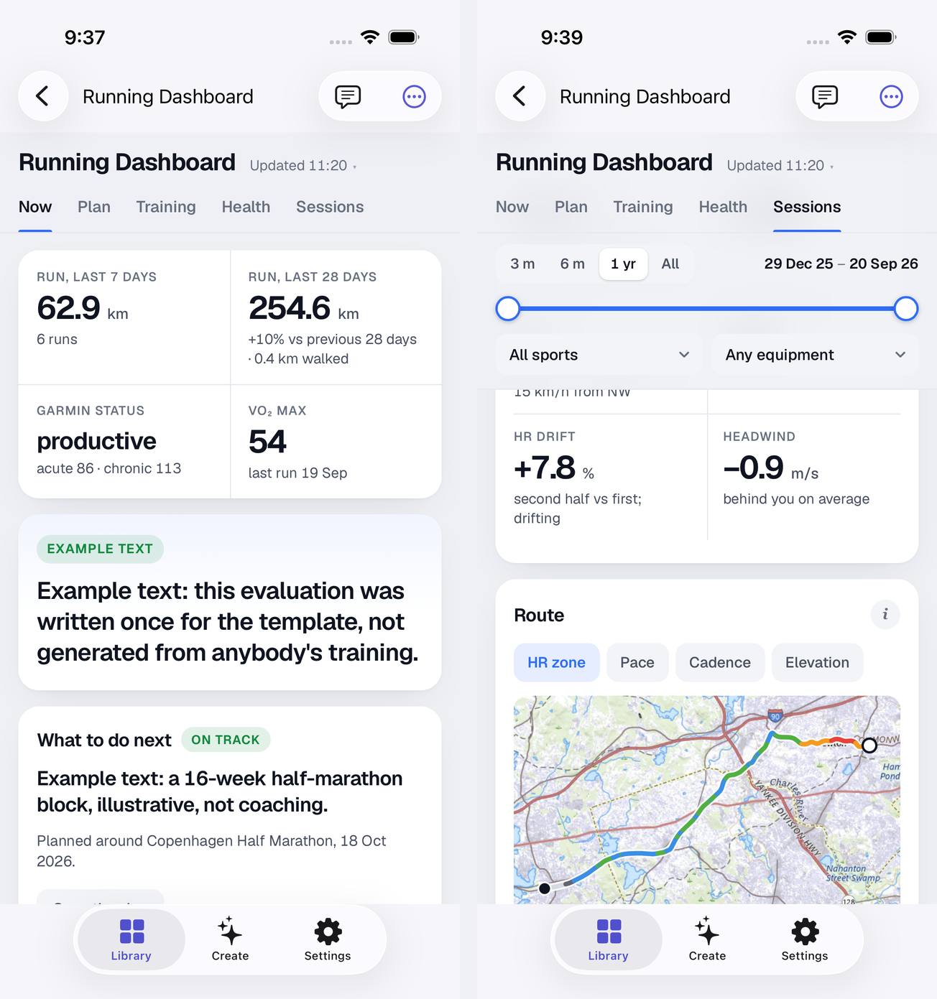

# Snuggery live apps

**This is a template. Nothing of yours goes here** — tap *Use this template* on GitHub to make
your own copy, and work in that. What follows describes the copy you will have.

One repository holding every mini-app whose data refreshes on a schedule, and the
jobs that refresh them.

The loop, once it is running: a GitHub Action rewrites a small JSON file here →
a Shortcut on your phone copies that file into the app → you open the app and
see today's numbers. Snuggery itself never goes online.

**Click *Use this template* to make your own copy, and make it private** if any
app here will ever hold something personal. A repository is as private as its
most sensitive file, git history cannot be un-published, and it is easier to
start private than to remember to switch before the wrong commit.

---

## What is in here

Two complete apps. Both are examples — neither holds anybody's real data. Copy
one, delete both, or ignore them.

| App | What it is | Try it | Make it yours |
| --- | --- | --- | --- |
| **Hello Live** | A UTC clock and three numbers rewritten about hourly by a GitHub Action. Depends on no outside service, so it proves your loop before anything real is built. | [`zips/hello-live.zip`](zips/hello-live.zip) | nothing to set up — it already runs |
| **Running Dashboard** | Eight panes of running from a Garmin watch: weekly volume, training load, heart-rate zones, sleep and HRV, per-session charts with a route map, and a coaching evaluation. **Ships with made-up data — nine months of running with a half-marathon block in progress, its recent runs drawn along segments of famous marathon courses — and says so on screen.** | [`zips/running-dashboard.zip`](zips/running-dashboard.zip) | [`running-dashboard/PROMPT.md`](running-dashboard/PROMPT.md) |



Deleting an example is deleting its folder, its workflow in
`.github/workflows/` and its script(s) in `scripts/`. Nothing else refers to
them.

---

## Setting up: once ever, then once per app

Most of the work happens exactly once. Keeping the two lists apart is the whole
point of this page, because the first app looks like an afternoon and the fifth
is genuinely one line.

### Once, ever

1. **This repository** — *Use this template*, private.
2. **A token**, if the repo is private — github.com/settings/personal-access-tokens →
   fine-grained → this repository only → **Contents: Read-only**. Give it a long
   expiry and write the date at the bottom of this file.
3. **One shortcut** on your phone, holding a Dictionary of *app name → data
   address* and a *Repeat with Each*. The recipe is below.
4. **One automation** that runs it — Shortcuts → Automation → Time of Day →
   Run Immediately.

### Every new app

1. **Ask an agent to build it**, in a session attached to this repository.
2. **Install it once** — open its `zips/<app>.zip` address in Safari → Share → Snuggery.
3. **Add one row** to the Dictionary in your shortcut: display name → data address.

That is the whole per-app cost. Nothing else changes, ever.

---

## Layout

```
<app-folder>/            one folder per app, named however you like — may hold several files
  index.html             the whole app: inline CSS and JS, no build step
  miniapp.json           display name and entry point
  data/snapshot.json     THE ONLY FILE THAT CHANGES
scripts/                 one refresh script per app
garmin-raw/              Running Dashboard's append-only raw store
.github/workflows/       one refresh workflow per app, plus the ZIP builder
zips/<app-folder>.zip    built automatically; this is what you install from
screenshots/             pictures for this README; not zipped, not part of any app
```

Both `hello-live/` and `running-dashboard/` are complete working examples. Install
Hello Live first and run your shortcut against it before building anything
real — if it updates, your loop works, and any later problem is in the new app
rather than in the setup. Either folder can be deleted once you no longer need
it as a reference.

**An app is not always one file.** Hello Live is a single `index.html` with its
CSS and JS inline. Running Dashboard is `index.html` plus `app.js`, `style.css`,
and a `data/` folder holding a snapshot, six session streams, and about a
megabyte of map tiles. The ZIP takes the app's folder whole either way — still
no build step.

`garmin-raw/` is Running Dashboard's raw store, separate from its app folder: the
files its pull script merges new activity into, plus the four files the
optional coaching routine writes. Delete it along with `running-dashboard/` if you
remove the app.

## Conventions worth keeping

- **Everything that changes lives in `data/snapshot.json`.** The HTML and JS
  should go untouched for months while the data is replaced daily.
- **Document the JSON's shape in a comment at the top of the app's script.**
  Whatever rewrites that file next year will not have read the conversation that
  created it.
- **Carry a `generatedAt` timestamp and show it.** A dashboard that cannot tell
  you how old it is will quietly show you last week.
- **Add a top-level `ask` array — flat rows, plain keys, at most a couple of hundred.**
  Snuggery's *Ask* reads exactly that key when someone asks a question about the app's
  data (counts, totals and extremes are worked out by the app, not guessed), and shows
  `generatedAt` beside the answer as *Data from 13:09*. Without it, a question about the
  data has only the raw JSON to go on. It is for reading, not for drawing: one row per
  city with today's numbers, one per activity for the last two months — whatever a person
  would ask about in words.
- **Keep `data/snapshot.json` small.** Hundreds of kilobytes is typical, a few megabytes is fine;
  the Shortcut refuses over 32 MB, and a phone parses 20 MB of JSON in seconds on every open.
  Aggregate on the job side — a dashboard shows what a person can read, not everything measured.
- **Fail loudly.** If the file is missing, unparseable, or the wrong shape, say
  so on screen. Never draw an empty chart as though it were data — a plausible
  blank dashboard is worse than an error, because it gets believed.
- **Re-read on `visibilitychange`.** Reads are fresh from disk, so this one line
  is what makes an app opened this morning show this morning's numbers. Snuggery fires the
  same event when new data lands while the app is open — so re-render in place, keeping the
  selected tab and scroll position, rather than rebuilding the page.

## About the Garmin connection

`scripts/garmin_pull.py` uses the open-source `garminconnect` library, which
reaches the same web API Garmin's own apps use. It is not an official API —
Garmin can change it without notice. The library usually catches up within
days, and the app's stale-data warning shows the gap in the meantime. You sign
in with your own account; the session tokens live in your repository's
`GARMINTOKENS` secret and nowhere else. Nothing passes through anybody else's
server. See `running-dashboard/PROMPT.md` for setup.

## The map under the route

The Sessions pane draws each run over a topographic basemap. The tiles
travel inside the app's ZIP, so the phone fetches nothing — mini-apps in
Snuggery cannot reach the network.

`scripts/garmin_pull.py` fetches the tiles once per session, trying three
sources in order; each answers only inside its own coverage, so a route falls
through to the first that has it, and the app credits whichever drew:

- **Kartverket** (the Norwegian Mapping Authority), Norway — open data under
  **CC BY 4.0**, credited "© Kartverket". Its terms add that the detail at
  zoom 12–20 comes from the Geovekst partnership and may be used as is in a
  service, while *copying* it needs the rights holders' permission — which is
  why the demo ships no Kartverket tiles, although your own private copy
  fetching them for your own runs is exactly the use the terms describe.
- **USGS The National Map**, the United States — **public domain**, no
  restrictions; the USGS asks for the acknowledgment the app prints. The
  demo's tiles come from here, for the three US courses.
- **OpenStreetMap**, everywhere else — credited "© OpenStreetMap
  contributors". Under OSM's tile usage policy, put your own repository URL in
  `TILE_AGENT` (`scripts/garmin_pull.py`) so requests are identifiable, and
  the script's own limits — at most 300 tiles a run, one run an hour, nothing
  re-fetched — keep a personal dashboard inside fair use. If you run a lot of
  routes, point `TILE_SOURCES` at a provider of your own.

**No OpenStreetMap tiles ship in this repository**, deliberately: the OSM tile
policy covers live fetching, not redistribution inside a downloadable archive.
Your own copy fetches its own. The demo's *routes* are another matter: they are
segments of six famous marathon courses whose shapes were derived from
OpenStreetMap data, so `scripts/demo_courses.json` and the demo streams made
from it are published under the ODbL with the attribution in
`running-dashboard/TILES.md`. Your own pull replaces them with your runs.

Do not want a basemap? Delete `running-dashboard/data/tiles/` — the route card
draws the coloured track on its own background, as the demo's Berlin, London
and Tokyo sessions do.

## The coaching text is optional, and the refresh does not write it

Running Dashboard's Now, Plan and Sessions panes can show an evaluation, a plan,
race predictions, and per-session notes. Those come from four files in
`garmin-raw/` — `assessment.json`, `plan.json`, `racecast.json`, `notes.json`
— written by a separate scheduled agent session, once a day, that reads what
the pull committed. The pull never writes them. Absent, the panes say so and
every number still works.

The demo's text is example text, and is labelled as such on screen. The
shapes are in the header comment of `running-dashboard/app.js`.

## Things that will cost you an afternoon if nobody says them

**`schedule:` only runs from the default branch.** A workflow on a pull-request
branch is inert however correct it is. Merge to `main` before expecting a run.

**GitHub cron is best-effort.** Late by 5–20 minutes is normal, longer under
load, and a newly added schedule often skips its first slot. Say "about hourly",
never "at 7 past".

**Triggering a workflow by hand proves the job, not the schedule.** They are
different things, and a manual run is misleading precisely because it exercises
every line of the workflow and goes green. The only evidence the *schedule*
works is a run whose trigger reads `schedule`:

    gh run list --repo <owner>/<repo>            # look at the trigger column
    gh api "repos/<owner>/<repo>/actions/runs?event=schedule" --jq .total_count

If that count is zero, your schedule has never run, however many green ticks the
Actions tab shows. Check it once, on the day you set this up — otherwise you
find out from a dashboard quietly showing yesterday's numbers.

**Which clock you use is a choice, and it is yours.** GitHub's own schedule costs nothing extra and,
measured on one account, delivered a few runs a day in batches with hours-long gaps and a nine-hour
wait for the first. An external trigger — a free web form or a small Cloudflare Worker sending the
same `workflow_dispatch` — delivers on the hour for one more account and a token scoped to
*Actions: write* only. A scheduled agent session can reach connectors a bare cron cannot. Each is
right for somebody. **`scheduler/README.md`** lays them out with what each is for and what it costs;
plan it with your agent.

---

## The shortcut

One shortcut refreshes every app here.

1. **Dictionary** — one row per app: key = the app's display name, value = the
   raw address of its `data/snapshot.json`.
2. **Repeat with Each**, over the Dictionary's **Keys** — tap the Dictionary pill in
   the Repeat and choose *Keys*. Not over the Dictionary itself: Shortcuts treats a
   dictionary as one item, runs once, and joins every name into a single string.
   That works with one row and breaks with two. Inside the loop, three actions:
   - **Get Dictionary Value** → key `Repeat Item`, in the Dictionary.
   - **Get Contents of URL** → the *Dictionary Value* from the step above.
     If the repo is private, add a header: `Authorization` = `Bearer <token>`,
     and `Accept` = `application/vnd.github.raw`.
   - **Update a File in a Snuggery App** → leave **App** empty, set
     **App name** to `Repeat Item`, set **Text instead of a file** to the
     output of *Get Contents of URL*, leave **Path in the app** empty.
3. **Test it with two rows.** One row cannot show the difference.

Two field traps, both of which everyone hits once:

- The fetched JSON goes in **Text instead of a file**, never **File**. A web
  address returning JSON hands Shortcuts a *dictionary*, and the File field
  refuses it.
- **App** is a picker and will not take a variable. That is exactly why
  **App name** exists — it is a text field, so a loop can fill it.

Shortcuts stops at the first action that fails, so a deleted app halts the rest
of the chain.

**Refreshing on demand.** Separate from the schedule, *Keep This Up To Date* in Snuggery ends with
a **Run now** row: the name of **one rebuild shortcut** (suggested `Rebuild a Snuggery App`) and a
button — and the app's ⋯ menu has **Rebuild Data Now**, the same thing one tap away; the dashboard
reloads by itself when the new file lands. Snuggery opens it with the app's name as the shortcut's input — that is all Snuggery does; it
never goes online. The shortcut is built once (Snuggery offers a ready-made one) and holds a
Dictionary with one row per app: key = the app's exact name; value = a Dictionary with `job` =
`https://api.github.com/repos/OWNER/REPO/actions/workflows/<file>/dispatches` and `data` = the
published data address. It runs the row it was named: **Get Contents of URL** as a POST to `job`
(body `{"ref":"main"}`, header `Authorization: Bearer <token with Actions: write>`); **Open App** →
Snuggery, so you land back in the app while the rest runs behind it; **Wait** about a minute and a
half; **Get Contents of URL** of `data`; **Update a File in a Snuggery App** with *App name* =
the input and *Text* = that contents. Adding an app is adding its row.

**Data and code are two different hops.** The loop above refreshes `data/snapshot.json` and
nothing else. When an app's *code* changes, `zips/<app>.zip` is rebuilt automatically; to get it
onto the phone, either open the ZIP's address in Safari → Share → Snuggery → **Replace the app**
(it reloads in place, even while open), or keep a second, one-tap shortcut: **Get Contents of URL**
(the ZIP's address, with the same header if the repo is private) → **Update a Mini-App** → pick the
app. Do not put that in the hourly loop — it would replace and restart the app every hour.

---

## Token expiry

| Token | Scope | Expires |
| --- | --- | --- |
| _(name it here)_ | Contents: Read on this repo | _(write the date here)_ |

When it lapses, every app in this repository takes a 404 body over its data on
the same run. This table is the cheapest possible defence against that.

---

MIT licensed — see [LICENSE](LICENSE). Two exceptions travel with the demo data and are spelled
out in [TILES.md](running-dashboard/TILES.md): the map tiles under `running-dashboard/data/tiles/` are US
Geological Survey work in the public domain, and the demo's route shapes derive from OpenStreetMap
under the ODbL. Copy it, change it, ship it.
