# Snuggery live apps

**Just want an app on your iPhone? There is nothing to copy or set up.** In Safari on the iPhone,
tap [**Install Milky Way**](https://github.com/mtomasgaard/snuggery-apps-template/raw/main/zips/milky-way.zip) (6.5 MB) — or any app in
[the install table](#install-any-of-them-on-your-phone--three-taps) — tap **Download** if Safari
asks, then open the download and choose **Share → Snuggery**.

**This is a template. Nothing of yours goes here** — tap *Use this template* on GitHub to make
your own copy, and work in that. What follows describes the copy you will have.

One repository holding every mini-app whose data refreshes on a schedule, and the
jobs that refresh them.

The loop, once it is running: a GitHub Action rewrites a small JSON file here →
a Shortcut on your phone copies that file into the app → you open the app and
see today's numbers. Snuggery itself never goes online.

**Click *Use this template* to make your own copy, and make it private** if any
app here will ever hold something personal. A repository is as private as its
most sensitive file, git history cannot be un-published, and it is easier to
start private than to remember to switch before the wrong commit.

---

## What is in here

Twelve complete apps. All are examples — none holds anybody's real data. Copy
one, delete them all, or ignore them.

**Five of them cost you nothing to run.** Hello Live, World News, Power Hours,
Global Wind and Global Weather are refreshed by this repository's own workflows,
from sources that need no key and no account, so they work from the moment you install them
and keep working whether or not you ever copy this template. **Outdoor Window**
is free in the same way but cannot run on its own: the forecast is for wherever
*you* are, so your own Shortcut asks the phone and fetches it. **Running
Dashboard** and **Finances** are the two that need credentials — a Garmin
sign-in and a bank connection — and until you add them, both show made-up
data. Finances says so on screen; Running Dashboard is built to look like a
real copy, so its entry below and its own docs say so instead. **Anatomy** (21 MB), **Norne Reservoir** (15 MB), **Besseggen** (17 MB) and
**Milky Way** (6.5 MB) are the big ones: a human body, an oil field, a mountain ridge and our galaxy,
each in 3D. They need
nothing at all, and they live here rather than in Snuggery's built-in starter
pack precisely because of that size — install any of them the same way as every app on this page:
three taps, just below.

## Install any of them on your phone — three taps

1. **On the iPhone, in Safari**, tap an app's **Install …** link in the table below (or its
   **Get the ZIP** link further down). If Safari asks whether to download it, tap **Download**.
2. Tap the download arrow in Safari's address bar and tap the ZIP, then the **Share** button — or
   open **Files → Downloads**, touch and hold the ZIP, and tap **Share**.
3. Choose **Snuggery**. It appears in your Library and opens with one tap. Nothing else to set up.

**Just want the galaxy?** On your iPhone, open [**Install Milky Way**](https://github.com/mtomasgaard/snuggery-apps-template/raw/main/zips/milky-way.zip) in Safari
(a 6.5 MB download), then steps 2 and 3. That's it — it needs no account, no key and no network
once installed.

Every app, one link each — open the link in Safari on the iPhone, then steps 2 and 3 above:

| App | Link | Size | Needs |
| --- | --- | --- | --- |
| Milky Way | [**Install Milky Way**](https://github.com/mtomasgaard/snuggery-apps-template/raw/main/zips/milky-way.zip) | 6.5 MB | nothing |
| Hello Live | [**Install Hello Live**](https://github.com/mtomasgaard/snuggery-apps-template/raw/main/zips/hello-live.zip) | tiny | nothing |
| Running Dashboard | [**Install Running Dashboard**](https://github.com/mtomasgaard/snuggery-apps-template/raw/main/zips/running-dashboard.zip) | 1.1 MB | a Garmin sign-in |
| Finances | [**Install Finances**](https://github.com/mtomasgaard/snuggery-apps-template/raw/main/zips/finances.zip) | tiny | a bank connection |
| World News | [**Install World News**](https://github.com/mtomasgaard/snuggery-apps-template/raw/main/zips/world-news.zip) | tiny | nothing |
| Outdoor Window | [**Install Outdoor Window**](https://github.com/mtomasgaard/snuggery-apps-template/raw/main/zips/outdoor-window.zip) | tiny | your own Shortcut |
| Power Hours | [**Install Power Hours**](https://github.com/mtomasgaard/snuggery-apps-template/raw/main/zips/power-hours.zip) | tiny | nothing |
| Global Wind | [**Install Global Wind**](https://github.com/mtomasgaard/snuggery-apps-template/raw/main/zips/global-wind.zip) | 1.1 MB | nothing |
| Global Weather | [**Install Global Weather**](https://github.com/mtomasgaard/snuggery-apps-template/raw/main/zips/global-weather.zip) | 2.4 MB | nothing |
| Anatomy | [**Install Anatomy**](https://github.com/mtomasgaard/snuggery-apps-template/raw/main/zips/anatomy.zip) | 21 MB | nothing |
| Besseggen | [**Install Besseggen**](https://github.com/mtomasgaard/snuggery-apps-template/raw/main/zips/besseggen.zip) | 17 MB | nothing |
| Norne Reservoir | [**Install Norne Reservoir**](https://github.com/mtomasgaard/snuggery-apps-template/raw/main/zips/norne-reservoir.zip) | 15 MB | nothing |

The same works from a Mac or PC: download the ZIP, AirDrop it to the phone, share it to Snuggery.
Inside Snuggery, *Keep This Up To Date* → **More examples in the starter repository** brings you
back to this page.

### Hello Live

A UTC clock and three numbers rewritten about hourly by a GitHub Action. Depends on no outside service, so it proves your loop before anything real is built.

**Needs:** nothing · [**Get the ZIP**](https://github.com/mtomasgaard/snuggery-apps-template/raw/main/zips/hello-live.zip) · It is the loop's proof, not a thing to personalise.

### Running Dashboard

Five panes of running from a Garmin watch — Now, Plan, Training, Health, Sessions: weekly volume and load, heart-rate zones, sleep, HRV, steps and weight, per-session charts with a route map, and a coaching evaluation. **Ships with made-up data — nine months of running with a half-marathon block in progress, its recent runs drawn along segments of famous marathon courses — and a coaching evaluation, plan and race forecast written for that runner, so the panes look the way a real copy's do.**

**Needs:** a Garmin sign-in · [**Get the ZIP**](https://github.com/mtomasgaard/snuggery-apps-template/raw/main/zips/running-dashboard.zip) · Make it yours: [`running-dashboard/PROMPT.md`](running-dashboard/PROMPT.md) · How it works: [`running-dashboard/NOTES.md`](running-dashboard/NOTES.md)

### Finances

Net worth, accounts, spending and savings from bank data over PSD2 (Enable Banking), plus the house, cars and loans no bank reports. **Static example: a generated fake household**, labelled as such.

**Needs:** a bank connection · [**Get the ZIP**](https://github.com/mtomasgaard/snuggery-apps-template/raw/main/zips/finances.zip) · Make it yours: [`finances/PROMPT.md`](finances/PROMPT.md)

### World News

Today's headlines by region from freely licensed newsrooms' RSS feeds, each linking out to the publisher. **Live**: refreshed daily here.

**Needs:** nothing · [**Get the ZIP**](https://github.com/mtomasgaard/snuggery-apps-template/raw/main/zips/world-news.zip) · Make it yours: [`world-news/PROMPT.md`](world-news/PROMPT.md)

### Outdoor Window

Scores the next 48 hours of weather against rules you write yourself and shows when to go out. **Live through your Shortcut**: it sends the phone's location to Open-Meteo and hands the answer to the app; no server.

**Needs:** your own Shortcut · [**Get the ZIP**](https://github.com/mtomasgaard/snuggery-apps-template/raw/main/zips/outdoor-window.zip) · Make it yours: [`outdoor-window/PROMPT.md`](outdoor-window/PROMPT.md)

### Power Hours

Tomorrow's electricity prices for one bidding zone and the cheapest hours to run each appliance. **Live**: refreshed here twice a day (NO2 in the demo).

**Needs:** nothing · [**Get the ZIP**](https://github.com/mtomasgaard/snuggery-apps-template/raw/main/zips/power-hours.zip) · Make it yours: [`power-hours/PROMPT.md`](power-hours/PROMPT.md)

### Global Wind

Five days of global 10 m wind from NOAA's GFS forecast, drawn as arrows over a colour layer — on a map you pan and zoom, or a globe you turn — with a five-day time player, a moving night side and a table of twelve cities at local noon. **Live**: refreshed here twice a day, to its own `data-global-wind` branch because the file is 1.2 MB.

**Needs:** nothing · [**Get the ZIP**](https://github.com/mtomasgaard/snuggery-apps-template/raw/main/zips/global-wind.zip) · Make it yours: [`global-wind/PROMPT.md`](global-wind/PROMPT.md)

### Global Weather

Global Wind with four more fields — temperature, rain, cloud and pressure beside it — on the same map and globe, and a tap anywhere giving all five numbers at that point. A separate app; installing it changes nothing about Global Wind. **Live**: refreshed here twice a day, to its own `data-global-weather` branch because the file is 2.9 MB. Not in Snuggery's built-in pack, for size.

**Needs:** nothing · [**Get the ZIP**](https://github.com/mtomasgaard/snuggery-apps-template/raw/main/zips/global-weather.zip) · Make it yours: [`global-weather/PROMPT.md`](global-weather/PROMPT.md)

### Anatomy

A full human body in 3D: 934 real anatomical structures from BodyParts3D in nine layers — skin, muscle, organs, arteries, veins, nerves, brain, cartilage, bone — that you peel, fade, isolate, search and explode. Three.js is vendored; nothing is fetched. **Static**, 30 MB unpacked.

**Needs:** nothing · [**Get the ZIP**](https://github.com/mtomasgaard/snuggery-apps-template/raw/main/zips/anatomy.zip) · Make it yours: [`anatomy/NOTES.md`](anatomy/NOTES.md)

### Besseggen

The Besseggen ridge in Jotunheimen in 3D, from Kartverket's 1 m elevation data: the marked trail from Gjendesheim over Veslfjellet to Memurubu draped on the terrain with a walking-time profile, real sun position and cast shadows for any date and hour, viewsheds and lines of sight with the visible peaks named, saved viewpoints and a fly-through. A planning tool, not a navigation aid — it has no position fix. **Static**, 27 MB unpacked.

**Needs:** nothing · [**Get the ZIP**](https://github.com/mtomasgaard/snuggery-apps-template/raw/main/zips/besseggen.zip) · Make it yours: [`besseggen/NOTES.md`](besseggen/NOTES.md)

### Norne Reservoir

The open Norne oil-field simulation model in 3D: 44,431 cells coloured by oil, water or gas saturation, pressure or rock property, played through 110 monthly frames of production history, with wells and their rates, explode and cut views. Optional topside layers from the Norwegian Offshore Directorate's open data — the sea surface and seabed, the FPSO, the seven subsea templates on their real in-service dates, the gas export line and a map of where the gas goes, reported production beside the simulation, and animated flow through wells and pipes, every one a toggle that is off until you switch it on; three saved viewpoints. Plain WebGL 2, no libraries. **Static**, 26 MB unpacked.

**Needs:** nothing · [**Get the ZIP**](https://github.com/mtomasgaard/snuggery-apps-template/raw/main/zips/norne-reservoir.zip) · Make it yours: [`norne-reservoir/NOTES.md`](norne-reservoir/NOTES.md)

### Milky Way

The Solar System, the Sun's neighbourhood and the Milky Way in one continuous 3D zoom, built from real data only. The planets and the Moon come from JPL's ephemerides for any date from 1900 to 2100, and 21 moons of Mars and the giant planets from 1950 to 2050. A time player runs the year forward, and each planet trails its real path. There are 9,989 asteroids and comets, and 220,000 stars in 3D, mostly at their Gaia distances; the constellations come apart as you leave the Sun. The galaxy is shown as it has actually been measured: globular clusters, satellite galaxies, stellar streams, where young stars crowd, and two published spiral-arm fits, each labelled as what it is. There is no artist's impression anywhere. **Static**, 9.9 MB unpacked. The Gaia-derived star, sky and young-star map files (`data/stars/deep.bin`, `data/stars/named.json`, `data/sky/gaia-dr3-counts.jpg`, `data/galaxy/young-*.png`) may be used only non-commercially; the young-star maps are redistributed under a permission their authors gave SpiralMap, and no grant to downstream redistributors was found.

**Needs:** nothing · [**Get the ZIP**](https://github.com/mtomasgaard/snuggery-apps-template/raw/main/zips/milky-way.zip) (6.5 MB) · Make it yours: [`milky-way/NOTES.md`](milky-way/NOTES.md)


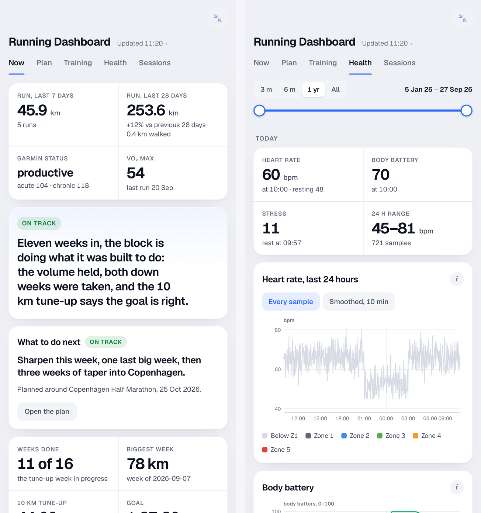
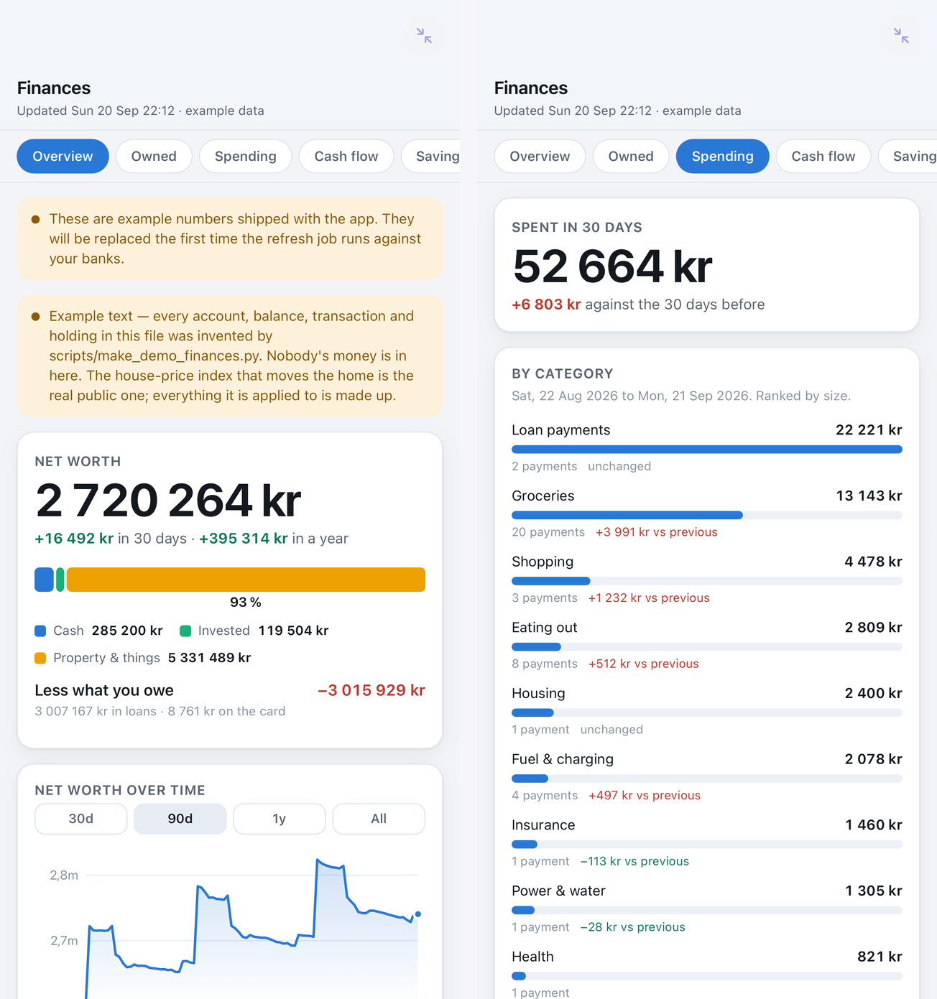

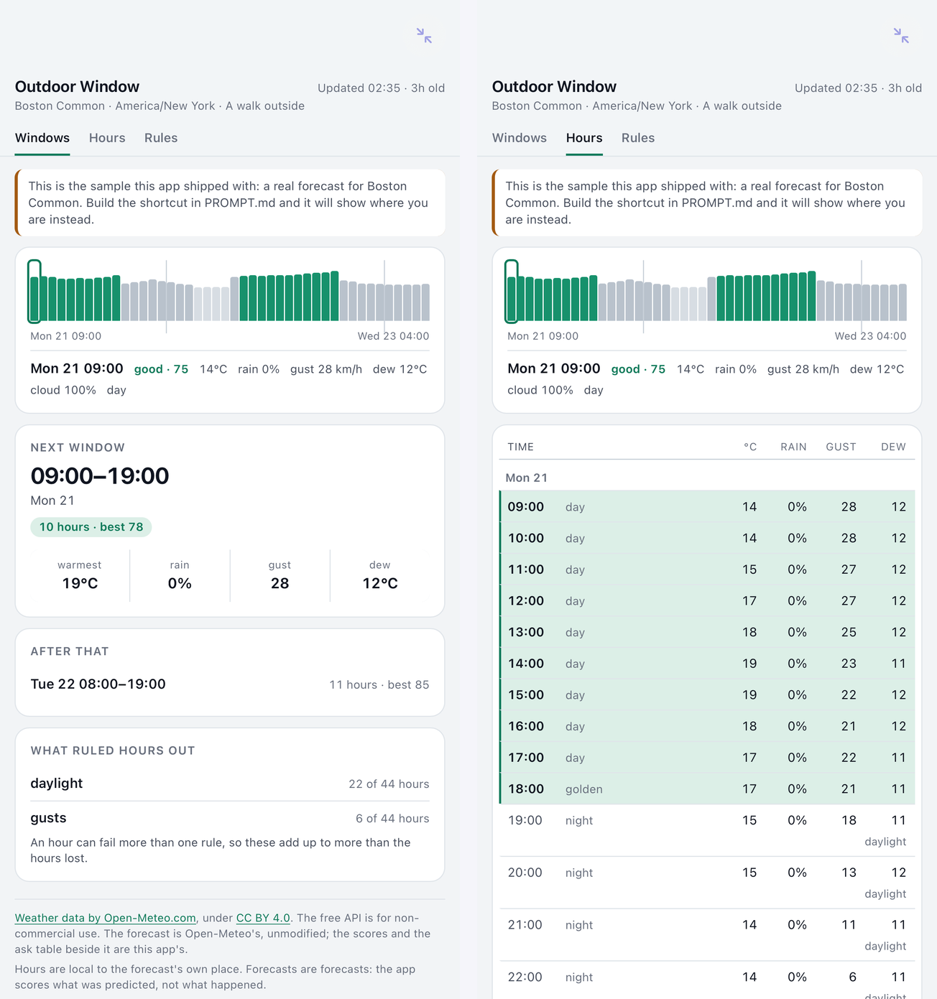
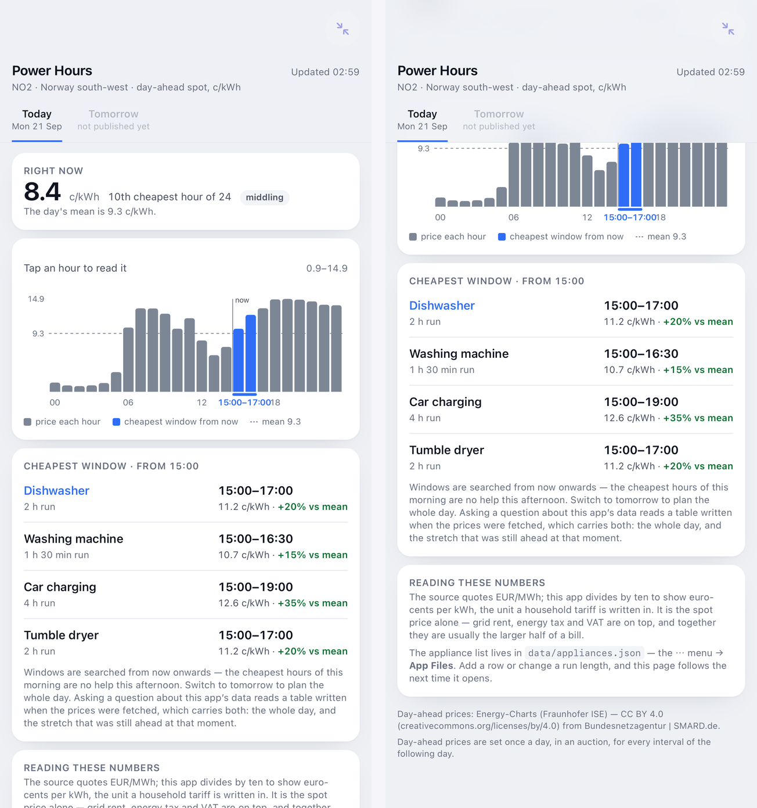
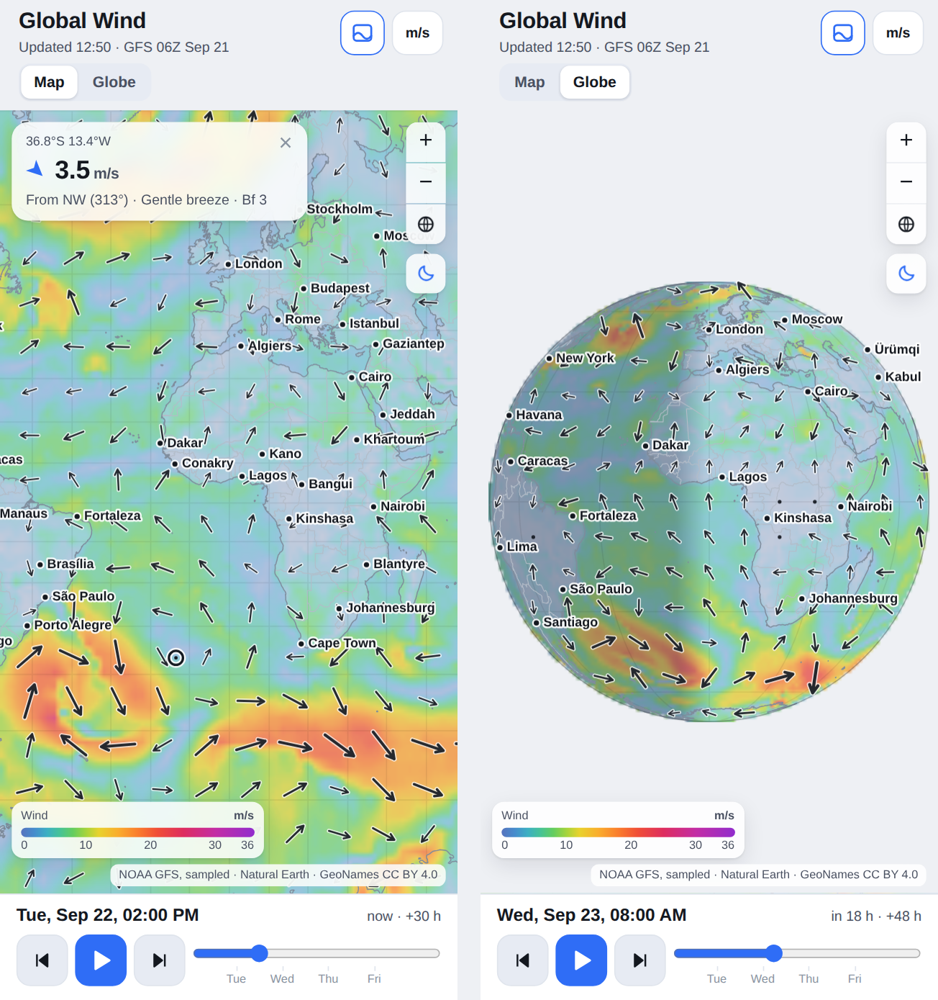
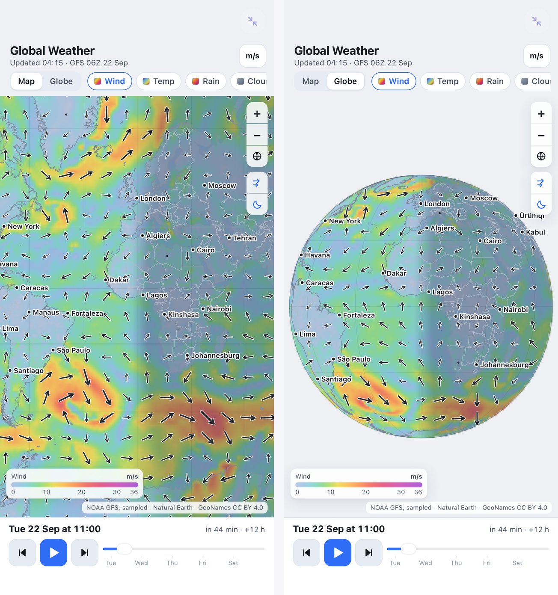
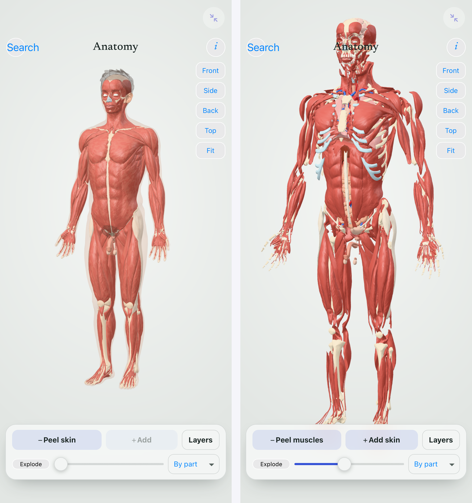
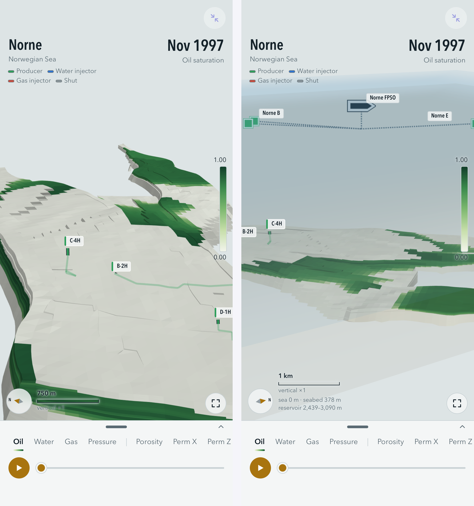
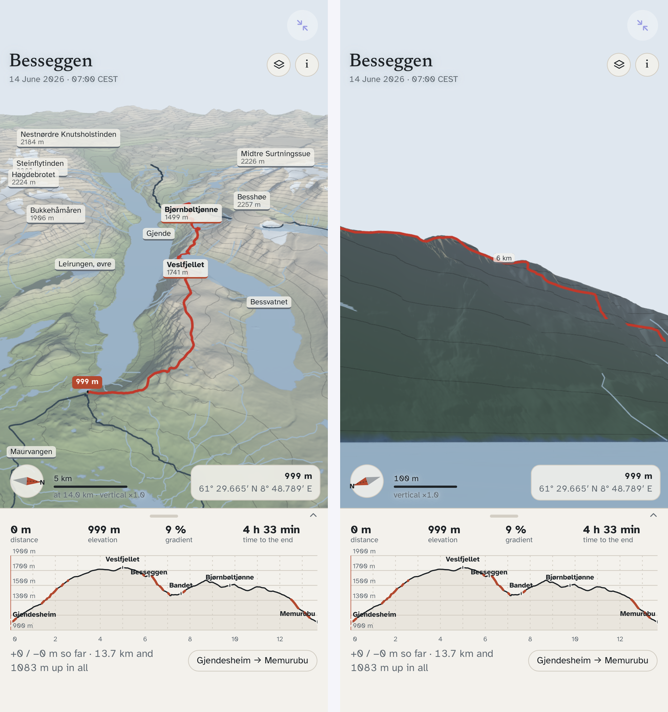
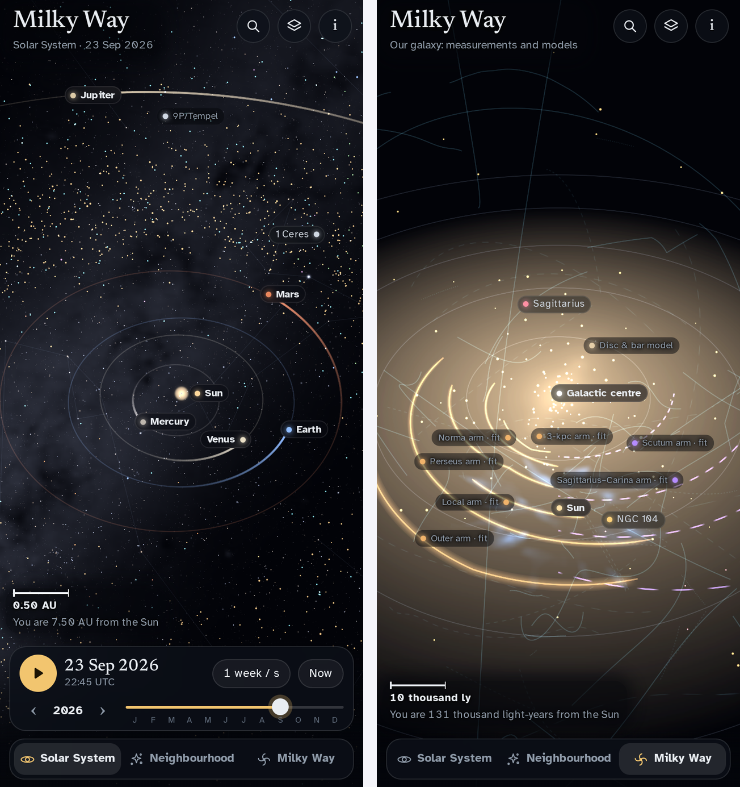

Deleting an example is deleting its folder, its workflow in `.github/workflows/`
and its scripts in `scripts/`, where it has them. Then take out its row, entry
and picture on this page, and its carve-out in `LICENSE` and in the licence line
at the foot of this page, if it has one, and any lines of its own in
`.gitignore`. Global Wind and Global Weather also keep their data on a branch of
their own (`data-global-wind`, `data-global-weather`), which goes too. The
pictures above, and whatever an app's pull keeps, live inside the app's folder
and go with it. Most live apps have one or two scripts; Running Dashboard has
several, and its [`NOTES.md`](running-dashboard/NOTES.md#what-belongs-to-this-app)
lists everything that belongs to it.

---

## How the data flows

Every live app here is the same shape with a different pull, and the picture shows the fullest
form of it: a pull script merges what is new into raw files, a build turns them into
`data/snapshot.json`, and an optional agent session writes text back that the next build carries
into the snapshot. Running Dashboard uses all of it; most apps skip the raw files and the agent
and write the snapshot straight from the source. Two hops, deliberately separate: the **code hop**
happens once (the ZIP, imported into Snuggery), the **data hop** happens on a schedule (one small
JSON file, copied by a Shortcut).

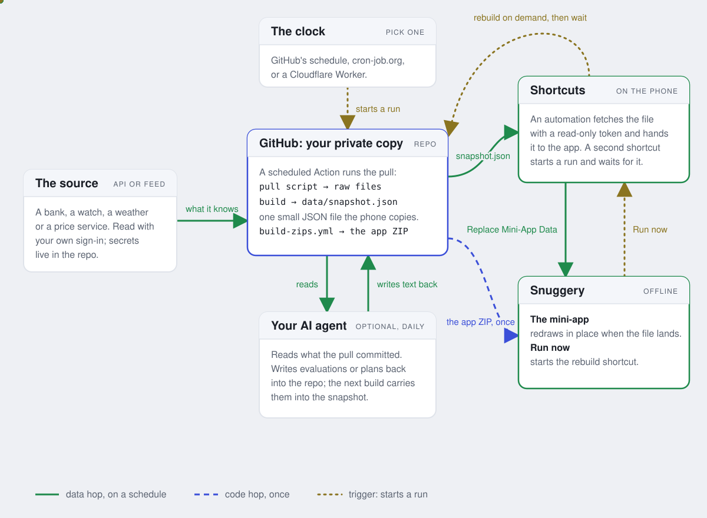

The same picture with the data moving along the lines: [`data-flow.html`](data-flow.html) — open it
in a browser, or keep it in Snuggery beside the apps; it needs no script.

What never happens: Snuggery itself makes no network request, and the mini-app cannot reach the
network or start a shortcut by itself. Every fetch above runs inside GitHub or inside the Shortcuts
app with your own accounts; the one thing Snuggery starts is the shortcut you named.

## Setting up: once ever, then once per app

Most of the work happens exactly once. Keeping the two lists apart is the whole
point of this page, because the first app looks like an afternoon and the fifth
is genuinely one line.

### Once, ever

1. **This repository** — *Use this template*, private.
2. **A token**, if the repo is private — github.com/settings/personal-access-tokens →
   fine-grained → this repository only → **Contents: Read-only**. Give it a long
   expiry and write the date at the bottom of this file.
3. **One shortcut** on your phone, holding a Dictionary of *app name → data
   address* and a *Repeat with Each*. The recipe is below.
4. **One automation** that runs it — Shortcuts → Automation → Time of Day →
   Run Immediately.

### Every new app

1. **Ask an agent to build it**, in a session attached to this repository.
2. **Install it once** — in Safari on the phone, open `github.com/<you>/<repo>/raw/main/zips/<app>.zip` (the raw address downloads; the normal page only shows it), then Share → Snuggery.
3. **Add one row** to the Dictionary in your shortcut: display name → data address.

That is the whole per-app cost. Nothing else changes, ever.

---

## Layout

```
<app-folder>/            one folder per app, named however you like — may hold several files
  index.html             the whole app: inline CSS and JS, no build step
  miniapp.json           display name and entry point
  data/snapshot.json     THE ONLY FILE THAT CHANGES ON THE PHONE
  screenshots/           pictures for this README; left out of the ZIP, so they
                         cost the phone nothing
  tools/ or pipeline/    how an app's data was built (Anatomy, Norne Reservoir,
                         Besseggen, Milky Way); left out of the ZIP in the same way
  raw/                   what a pull keeps that the phone does not need (Running
                         Dashboard); left out of the ZIP, and no ZIP is rebuilt for it
scripts/                 one or more refresh scripts per app
data-flow.html           the picture of the loop above, animated; data-flow.svg for the README
.github/workflows/       one refresh workflow per app, plus the ZIP builder
zips/<app-folder>.zip    built automatically; this is what you install from
```

Every app folder is a complete working example. Install Hello Live first and
run your shortcut against it before building anything real — if it updates, your
loop works, and any later problem is in the new app rather than in the setup.
Any folder can be deleted once you no longer need it as a reference, together
with its scripts and its workflow.

**An app is not always one file.** Hello Live is a single `index.html` with its
CSS and JS inline. Running Dashboard is `index.html` plus `app.js`, `style.css`,
and a `data/` folder holding a snapshot, six session streams, and about a
megabyte of map tiles. The ZIP takes the app's folder whole either way, less
the folders marked above as left out — still no build step.

## Conventions worth keeping

- **Everything the app shows that changes lives in `data/snapshot.json`.** The HTML and JS
  should go untouched for months while the data is replaced daily.
- **Document the JSON's shape in a comment at the top of the app's script.**
  Whatever rewrites that file next year will not have read the conversation that
  created it.
- **Carry a `generatedAt` timestamp and show it.** A dashboard that cannot tell
  you how old it is will quietly show you last week.
- **Add a top-level `ask` array — flat rows, plain keys, at most a couple of hundred.**
  Snuggery's *Ask* reads exactly that key when someone asks a question about the app's
  data (counts, totals and extremes are worked out by the app, not guessed), and shows
  `generatedAt` beside the answer as *Data from 13:09*. Without it, a question about the
  data has only the raw JSON to go on. It is for reading, not for drawing: one row per
  city with today's numbers, one per activity for the last two months — whatever a person
  would ask about in words.
- **Keep `data/snapshot.json` small.** Hundreds of kilobytes is typical, a few megabytes is fine;
  the Shortcut refuses over 32 MB, and a phone parses 20 MB of JSON in seconds on every open.
  Aggregate on the job side — a dashboard shows what a person can read, not everything measured.
- **Fail loudly.** If the file is missing, unparseable, or the wrong shape, say
  so on screen. Never draw an empty chart as though it were data — a plausible
  blank dashboard is worse than an error, because it gets believed.
- **Re-read on `visibilitychange`.** Reads are fresh from disk, so this one line
  is what makes an app opened this morning show this morning's numbers. Snuggery fires the
  same event when new data lands while the app is open — so re-render in place, keeping the
  selected tab and scroll position, rather than rebuilding the page.
- **No network from the app.** A mini-app cannot reach the network, so
  everything it draws — map tiles, fonts, textures — travels inside its ZIP, and
  it fetches nothing but files in its own folder.
- **A licence to fetch live is not a licence to redistribute.** A tile server or
  feed that lets your copy fetch from it may still forbid shipping what it
  returned inside a downloadable archive, or republishing it in a public
  repository. Whatever travels under terms of its own is named as a carve-out in
  `LICENSE` and in the app's own docs.
- **Credentials live in the repository's Actions secrets** — never in a file in
  the repository, the snapshot, a log or a commit message. A job reads them from
  its environment.
- **One writer per file.** The scheduled pull never writes a file an agent
  session writes, and the other way round, so neither can overwrite the other's
  work. When an optional file is missing, the app says it is not there yet;
  it never draws a blank that passes for data.
- **A store the pull keeps between runs goes in the app's `raw/`** (Running
  Dashboard's does). It
  never ships: the ZIP builder leaves it out, and a commit to it rebuilds no ZIP.
  Everything else in the folder, bar the screenshots and build tools, goes into
  the ZIP and onto every phone that installs it.

## Things that will cost you an afternoon if nobody says them

**`schedule:` only runs from the default branch.** A workflow on a pull-request
branch is inert however correct it is. Merge to `main` before expecting a run.

**GitHub cron is best-effort.** Late by 5–20 minutes is normal, longer under
load, and a newly added schedule often skips its first slot. Say "about hourly",
never "at 7 past".

**Triggering a workflow by hand proves the job, not the schedule.** They are
different things, and a manual run is misleading precisely because it exercises
every line of the workflow and goes green. The only evidence the *schedule*
works is a run whose trigger reads `schedule`:

    gh run list --repo <owner>/<repo>            # look at the trigger column
    gh api "repos/<owner>/<repo>/actions/runs?event=schedule" --jq .total_count

If that count is zero, your schedule has never run, however many green ticks the
Actions tab shows. Check it once, on the day you set this up — otherwise you
find out from a dashboard quietly showing yesterday's numbers.

**Which clock you use is a choice, and it is yours.** GitHub's own schedule costs nothing extra and,
measured on one account, delivered a few runs a day in batches with hours-long gaps and a nine-hour
wait for the first. An external trigger — a free web form or a small Cloudflare Worker sending the
same `workflow_dispatch` — delivers on the hour for one more account and a token scoped to
*Actions: write* only. A scheduled agent session can reach connectors a bare cron cannot. Each is
right for somebody. **`scheduler/README.md`** lays them out with what each is for and what it costs;
plan it with your agent.

---

## The shortcut

One shortcut refreshes every app here.

1. **Dictionary** — one row per app: key = the app's display name, value = the
   raw address of its `data/snapshot.json`.
2. **Repeat with Each**, over the Dictionary's **Keys** — tap the Dictionary pill in
   the Repeat and choose *Keys*. Not over the Dictionary itself: Shortcuts treats a
   dictionary as one item, runs once, and joins every name into a single string.
   That works with one row and breaks with two. Inside the loop, three actions:
   - **Get Dictionary Value** → key `Repeat Item`, in the Dictionary.
   - **Get Contents of URL** → the *Dictionary Value* from the step above.
     If the repo is private, add a header: `Authorization` = `Bearer <token>`,
     and `Accept` = `application/vnd.github.raw`.
   - **Update a File in a Snuggery App** → leave **App** empty, set
     **App name** to `Repeat Item`, set **Text instead of a file** to the
     output of *Get Contents of URL*, leave **Path in the app** empty.
3. **Test it with two rows.** One row cannot show the difference.

Two field traps, both of which everyone hits once:

- The fetched JSON goes in **Text instead of a file**, never **File**. A web
  address returning JSON hands Shortcuts a *dictionary*, and the File field
  refuses it.
- **App** is a picker and will not take a variable. That is exactly why
  **App name** exists — it is a text field, so a loop can fill it.

Shortcuts stops at the first action that fails, so a deleted app halts the rest
of the chain.

**Refreshing on demand.** Separate from the schedule, *Keep This Up To Date* in Snuggery ends with
a **Run now** row: the name of **one rebuild shortcut** (suggested `Rebuild a Snuggery App`) and a
button — and the app's ⋯ menu has **Rebuild Data Now**, the same thing one tap away; the dashboard
reloads by itself when the new file lands. Snuggery opens it with the app's name as the shortcut's input — that is all Snuggery does; it
never goes online. The shortcut is built once (Snuggery offers a ready-made one) and holds a
Dictionary with one row per app: key = the app's exact name; value = a Dictionary with `job` =
`https://api.github.com/repos/OWNER/REPO/actions/workflows/<file>/dispatches` and `data` = the
published data address. It runs the row it was named: **Get Contents of URL** as a POST to `job`
(body `{"ref":"main"}`, header `Authorization: Bearer <token with Actions: write>`); **Open App** →
Snuggery, so you land back in the app while the rest runs behind it; **Wait** about a minute and a
half; **Get Contents of URL** of `data`; **Update a File in a Snuggery App** with *App name* =
the input and *Text* = that contents. Adding an app is adding its row.

**Data and code are two different hops.** The loop above refreshes `data/snapshot.json` and
nothing else. When an app's *code* changes, `zips/<app>.zip` is rebuilt automatically; to get it
onto the phone, either open the ZIP's address in Safari → Share → Snuggery → **Replace the app**
(it reloads in place, even while open), or keep a second, one-tap shortcut: **Get Contents of URL**
(the ZIP's address, with the same header if the repo is private) → **Update a Mini-App** → pick the
app. Do not put that in the hourly loop — it would replace and restart the app every hour.

---

## Token expiry

| Token | Scope | Expires |
| --- | --- | --- |
| _(name it here)_ | Contents: Read on this repo | _(write the date here)_ |

When it lapses, every app in this repository takes a 404 body over its data on
the same run. This table is the cheapest possible defence against that.

---

MIT licensed — see [LICENSE](LICENSE), whose carve-outs name everything that travels under its own
terms: the US Geological Survey map tiles (public domain), the OpenStreetMap-derived route shapes
(ODbL) and the Geist typeface (SIL OFL) in Running Dashboard, spelled out in
[TILES.md](running-dashboard/TILES.md); the BodyParts3D geometry in Anatomy (CC BY-SA 2.1 JP, also
CC BY 4.0 at source — [CREDITS.txt](anatomy/CREDITS.txt)) with its vendored three.js (MIT) and two
SIL OFL fonts; the Norne benchmark model in Norne Reservoir (ODbL) with its topside layer from the
Norwegian Offshore Directorate's FactMaps and FactPages (NLOD) and a Natural Earth coastline (public domain —
[ATTRIBUTION.txt](norne-reservoir/data/ATTRIBUTION.txt)); Kartverket's DTM1 terrain (NLOD 2.0 / CC BY 4.0), Turrutebasen
(open), N50 (CC BY 4.0) and SSR (CC BY 4.0) in Besseggen ([CREDITS.txt](besseggen/CREDITS.txt)); in Milky Way, the
Gaia-derived star, sky and young-star map files (`deep.bin`, `named.json`, the sky JPEG and `young-*.png`; CC BY-NC
3.0 IGO, so non-commercial use only), the Stellarium files (`sun.jpg`, `moon.jpg`, `constellations.json`) and the
AT-HYG/HYG-derived star files (CC BY-SA 4.0), with its vendored three.js (MIT) and two SIL OFL fonts
([CREDITS.txt](milky-way/CREDITS.txt)); and, in Global Wind and Global Weather,
NOAA's forecast (public domain), Natural Earth coastlines (public domain) and GeoNames city labels
(CC BY 4.0, attribution required — [LICENSES.md](global-wind/assets/LICENSES.md)).